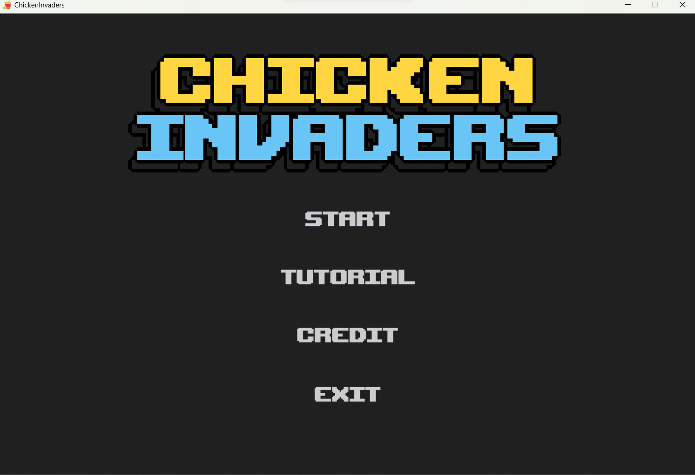
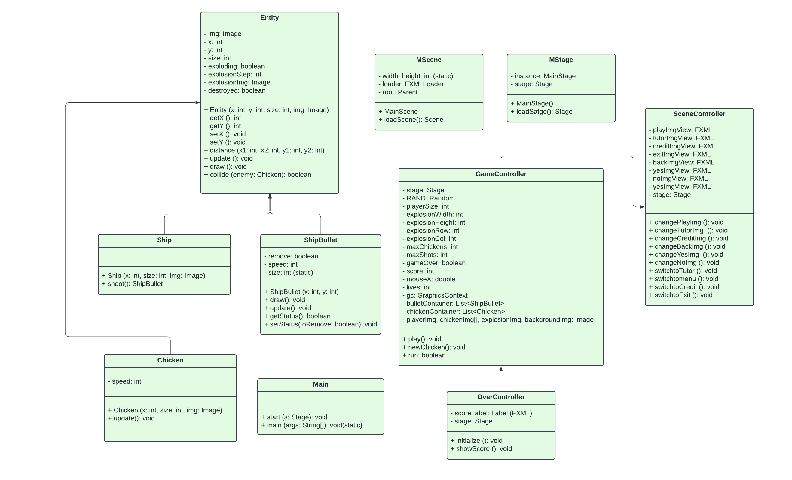

<!-- PROJECT LOGO -->
   

 

<!-- Shield.io Badges -->

	
[![Contributors][contributors-shield]][contributors-url]
[![Forks][forks-shield]][forks-url]
[![Stargazers][stars-shield]][stars-url]
[![Issues][issues-shield]][issues-url]

<!-- Welcome line -->

  This repository is home to an exciting Object-Oriented Programming (OOP) project, the classic game, Chicken Invaders, using Java.

<!-- TABLE OF CONTENTS -->
# Table of Contents
  <ol>
    <li>
      <a href="#Introduction">Introduction</a>
      <ul>
        <li><a href="#Team-members">Team Members</a></li>
	<li><a href="#installation">Installation</a></li>
	<li><a href="#motivation">Motivation</a></li>
	<li><a href="#task-allocation">Task Allocation</a></li>      
      </ul>
    </li>
    <li><a href="#Tool-Used">Tool Used</a></li>
    <li><a href="#features">Features</a></li>
    <li><a href="#challenges">Challenges</a></li>
    <li><a href="#acknowledgments">Acknowledgments</a></li>
    <li><a href="#references">References</a></li>
  </ol>

<!-- ABOUT THE PROJECT -->
# Introduction 

<!-- TEAM MEMBERS -->
## Team Members 

| Order |         Name          |     ID      |                  Email                  |                       Github account                        |                              Facebook                              |
| :---: | :-------------------: | :---------: |:---------------------------------------:| :---------------------------------------------------------: | :----------------------------------------------------------------: |
|   1   | Le Nguyen Van Phat | ITCSIU21214 |  ITCSIU21214@student.hcmiu.edu.vn | [Vanphat0211](https://github.com/Vanphat0211) | [Van Phat](https://www.facebook.com/profile.php?id=100016877142624) |
|   2   | Nguyen Nhat Khiem | ITDSIU21091 |  ITDSIU21091@student.hcmiu.edu.vn | [Khim3](https://github.com/Khim3) | [Khiem Nguyen](https://www.facebook.com/khiem.nguyen.042) |
|   3   | Nguyen Tri Tin | ITDSIU21123 |  ITDSIU21123@student.hcmiu.edu.vn | [MicroGix](https://github.com/MicroGix) | [Tin Nguyen](https://www.facebook.com/tinnguyen105/) |
|   4   | Le Thi Thuy Nga | ITDSIU21024 | ITDSIU21024@student.hcmiu.edu.vn | [Schrrodinger](https://github.com/Schrrodinger) | [Thuy Nga](https://www.facebook.com/profile.php?id=100032005854236) |

<!-- INSTALLATION -->
## Installation 
**Prerequisites**: Make sure that the following dependencies are installed on your machine:
- Git
- Java JDK 21
- JavaFX21

**Install Game**: Navigate to your local game directory and add necessary packages (set up JDK and JavaFX)

<!-- MOTIVATION -->
## Motivation 
We are working with this game as our project lab of Object Oriented Programming is a 4-credit course. During our investigation into how to create 2D games with Java, we remembered the Chicken Invaders game which was popular in our childhood.

<!-- TASK ALLOCATION -->
## Task Allocation 
| Order | Task                                  |  Person   | Contribution (%) |
| :---- |:--------------------------------------| :-------: | :----------: |
| 1     | Set up controllers, set up SFX, tester, prepare presentation slide | Hong Son  |      25      |
| 2     | Develop first version, build entities, create UML, prepare report | Nhat Khiem |      25      |
| 3     | GitHub repository host, design UI, design game mechanic, prepare report | Tri Tin |      25      |
| 4     | Develop first version, design UI, create UML, prepare report | Thuy Nga |      25      |

<!-- SPECIFICATIONS -->
# Specifications 
- JDK 21 
- Javafx
- Scene Builder
- Aesprite
- Apache Maven

<!-- FEATURES -->
# Features 
- Tutorials:
  - Try to survive as long as you can and eliminate chickens to get the highest score
  - You only have 3 lives to sustain throughout the entirety of the game
  - For each chicken get destroyed you will earn 2 points, however, if one of them get passed, you will lose 4 points. You lose the game when either your score is 0 or you lost all 3 lives
  - When reaching to certain points, your bullet will level up with bigger and faster bullet
  - Use mouse to move; A, S or Mouse click to shoot
- General:
  - START: start the game
  - TUTORIAL: introduce instructions on how to play the game
  - CREDITS: introduce the authors and developers who made this game
  - EXIT: exit the game

- Design

- UML

<!-- CHALLENGES -->
# Challenges
- *Working with Existing Code*: It was difficult to understand and develop for the existing codebase, sometimes it was hard to develop new features as all classes and packages are fixed
- *Balancing Difficulty*: Finding the right balance to make the game challenging but not too hard for gamers was a tough task.
- *Using JavaFX Framework*: As we were not familiar with the JavaFX framework, it was challenging to use it effectively.

<!-- ACKNOWLEDGMENTS -->
# Acknowledgments
- We would like to extend our heartfelt gratitude to everyone who contributed to the success of our OOP game project. This journey has been incredibly rewarding, and it wouldn’t have been possible without the contribution of each member.
- We’re grateful for the feedback and suggestions from our friends. Their insights have significantly improved the game experience. Thank you to our beta testers who volunteered their time to help us refine our game.
> [!IMPORTANT]
> This project utilizes several open-source tools, OpenAI, and libraries, and we extend our gratitude to the developers and maintainers of these resources. Your work has been vital in bringing our game to life.

<!-- REFERENCES -->
# References
* https://github.com/mostafaHegab/Chicken-Invaders
* https://wallpapercave.com/w/wp7872568
* https://openjfx.io/#
* https://www.youtube.com/@gasparcoding

(<a href="#header">Back to top</a>)

<!-- Badges link-->
[contributors-shield]: https://img.shields.io/github/contributors/MicroGix/OOP_Project?style=for-the-badge&label=CONTRIBUTORS 
[contributors-url]: https://github.com/MicroGix/OOP_Project/graphs/contributors
[forks-shield]:https://img.shields.io/github/forks/MicroGix/OOP_Project?style=for-the-badge&label=FORKS
[forks-url]: https://github.com/MicroGix/OOP_Project/forks
[stars-shield]: https://img.shields.io/github/stars/MicroGix/OOP_Project?style=for-the-badge&label=STARS
[stars-url]: https://github.com/MicroGix/OOP_Proeject/stargazers
[issues-shield]: https://img.shields.io/github/issues/MicroGix/OOP_Project?style=for-the-badge&label=ISSUES
[issues-url]: https://github.com/MicroGix/OOP_Project/issues
